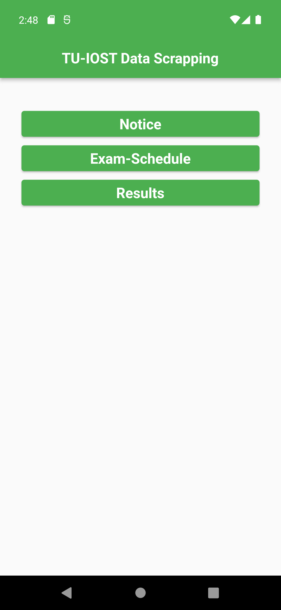
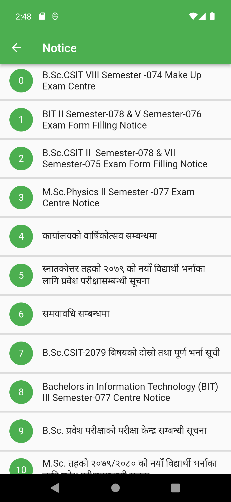
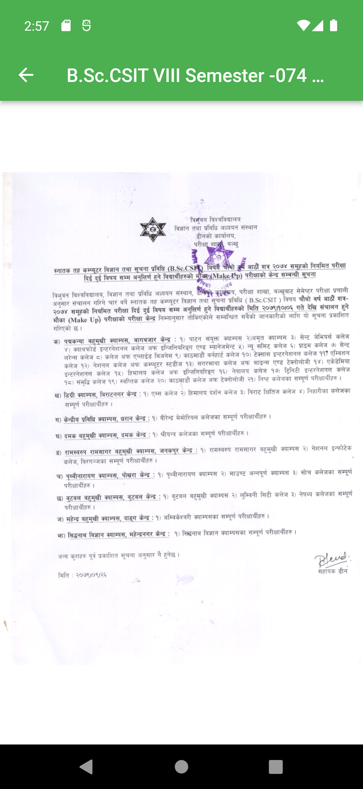

# FUIOST
##### Flutter App For scrappping tuiost data and showing the data in mobile view


## Features
- ###### Shows the current notice, exam schedule and results by Tribhuvan University Institute of Science & Technology (TUIOST),
- ######  It cached the pdf data in local storage and after 20hr the data is deleted from cache


## Getting Started 🚀

A new Flutter project.


This project is a starting point for a Flutter application.

A few resources to get you started if this is your first Flutter project:

- [Lab: Write your first Flutter app](https://docs.flutter.dev/get-started/codelab)
- [Cookbook: Useful Flutter samples](https://docs.flutter.dev/cookbook)

For help getting started with Flutter development, view the
[online documentation](https://docs.flutter.dev/), which offers tutorials,
samples, guidance on mobile development, and a full API reference.


<table>
  <tr>
    <td></td>
    <td></td> <td></td>

  </tr>
 </table>

 ### Libraries & Tools Used

* [Dio](https://github.com/flutterchina/dio)
* [Html](https://pub.dev/packages/flutter_cached_pdfview)
* [Flutter Pdf View](https://pub.dev/packages/flutter_cached_pdfview)


## Installation


Download or clone this repo

First Step:

```sh
git clone https://github.com/Sushil787/FuIOST.git prj
```

Second Step:

```sh
cd prj 
```

 Third Step:

```sh
flutter pub get
```
Fourth Step:
```sh  
flutter run 
        
```

#### Building for source

For release:

```sh
flutter build apk
```

